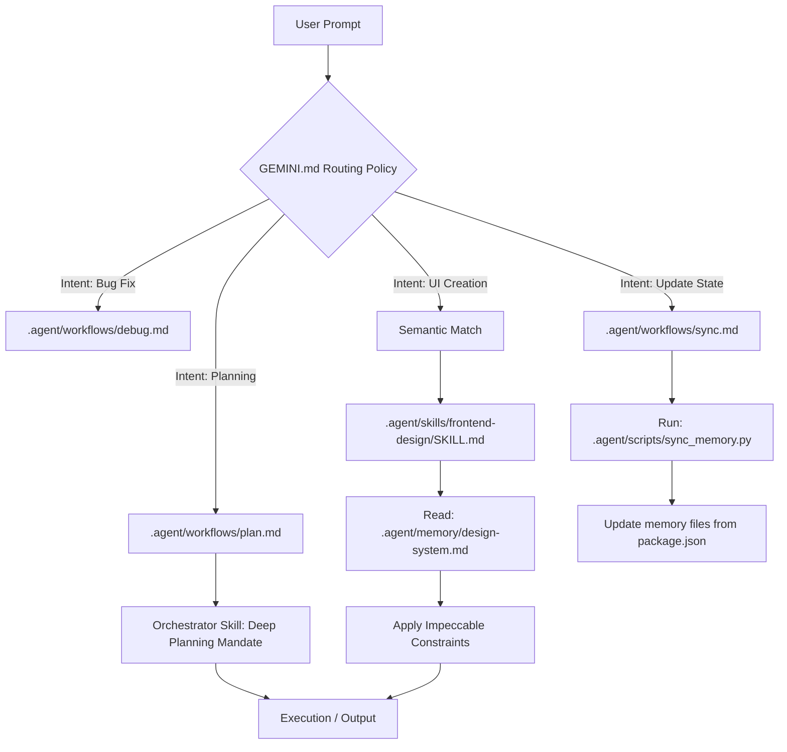

# Architectural Overview: Zenithgravity-kit

## 1. The Gap Analysis: Why this Kit Exists

Out of the box, AI IDEs provide an execution environment: they can read files, run commands, and edit code. However, unmodified LLMs generally struggle with two recurring patterns:

1. **Lazy Execution**: LLMs tend to summarize complex architectural changes into short bullet points rather than writing exhaustive technical plans.
2. **Context Amnesia (AI Slop)**: Every new chat resets the AI's understanding of your design system, causing it to fall back on generic training data (e.g., heavy drop shadows, Bootstrap blue).

**Zenithgravity-kit acts as a behavioral harness.** It doesn't fine-tune weights. It manipulates the execution loop using a rigid directory of rules, preventing the AI from making unguided assumptions.

---

## 2. Core Concepts

### A. Behavioral Anchoring

LLMs are generalists. Asking them to "write code" produces average code. Asking them to act as a specific persona activates entirely different probability curves.
- **Implementation**: When users request complex changes, the kit triggers a "Deep Planning Mandate", forcing the AI to output edge-cases and structural checks before touching code.

### B. State Anchoring

LLMs lose visual consistency between sessions.
- **Implementation**: We mapped styling variables to `.agent/memory/design-system.md`. The router forces the AI to read this anchor before writing CSS or HTML, ensuring brand consistency.

### C. Token Compression (RTK)

Standard file system scans (like `ls -laR`) dump massive amounts of redundant text into the context window.
- **Implementation**: The framework forces the LLM to wrap large scans in `rtk` (Rust Token Killer). Proxying commands through `rtk pytest` or `rtk grep` removes boilerplate, cutting token spend by 60-90%.

---

## 3. The Execution Flow

When a user submits a prompt, the kit intercepts and routes the intent:

## 4. The Anatomy of the Kit

- **`rules/GEMINI.md`**: The routing brain. Maps natural language intents to specific roles.
- **`memory/`**: The state anchors. Prevents the AI from hallucinating missing stack dependencies or design tokens.
- **`skills/`**: The constraints payload. Domain-specific markdown files (e.g., `frontend-design`, `devops-architect`).
- **`workflows/`**: The pipelines. Multi-step bash procedures for macro tasks.
- **`scripts/`**: The cross-platform logic checks. Python automation files like `detect_stack.py` and `verify_changes.py`.
